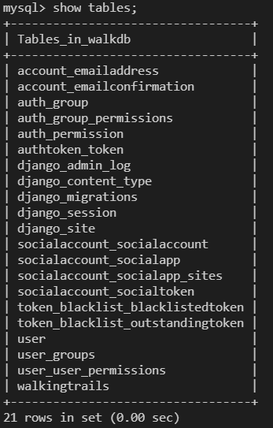

# WalkingTogether
🐶2021캡스톤디자인
# 개발환경
|구분|항목|버전|적용 내역|
|---|---|---|----------|
|OS|Windows10| | |
|OS|ubuntu linux| |배포 서버|
|개발환경(IDE)|visual studio code| | |
|Framework|Django|3.2.5|백엔드 개발|
|DB|MySQL|8.0.22| |
|개발언어|python3|3.8.5|백엔드 개발|

그 외 자세한 버전 정보는 [requirements.txt](./requirements.txt) 참고 요망.
# DB
`mysql -u root -p` 로 mysql 접속한 뒤, [walkingtrails.sql](walkingtrails.sql) 의 쿼리문 순차 실행하면 db셋팅 동일하게 됩니다.
- DB명 : walkdb
- id/passwd : npnc/npnc
- 주요 table 명
  - 공공데이터 산책로 : walkingtrails
  - 유저 : user         

## BE

### 21.07.25
- user app의 회원가입/로그인 기능 추가
- maps app의 최단거리 출력 기능 추가

#### 발생오류
`django.db.migrations.exceptions.InconsistentMigrationHistory: Migration admin.0001_initial is applied before its dependency users.0001_initial on database 'default'.`
- 최단거리 로직 에러

### 21.08.02
**1차 통합 완료**
- migration 오류 해결
  - DB 초기화하고 migration 먼저 한 다음에 차차 DB 추가하면 되는거였음
- 최단거리 로직 에러 해결
- [CORS](https://hyeonyeee.tistory.com/65), [permission](https://www.django-rest-framework.org/api-guide/permissions/) 추가