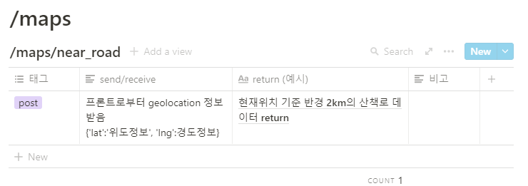

# 산책갈까?
🐶2021캡스톤디자인
## 팀 정보
|팀원|역할|개발|
|---|---|---|
|[박정연](https://github.com/jeongyeon-park)|팀장,프론트엔드 메인코더|react 개발|
|[정주영](https://github.com/jyj544)|프론트엔드 개발|HTML, CSS, javascript 화면개발|
|[유승아](https://github.com/SeungAh-Yoo99)|백엔드 메인코더|회원가입, 회원정보수정, 강아지등록 및 수정, 산책로 좋아요, 채팅기능 개발|
|[이다영](https://github.com/youngDaLee)|백엔드 개발, 서버 및 데이터 관리|산책로 데이터 정제, 가까운 산책로 출력, 산책로 세부 페이지, 산책로 검색, 리뷰 기능 개발, 배포, 도메인 연결 및 ssl 인증서 발급|
## 프로젝트 정보
https://www.wannawalk.co.kr:3001/
### 프로젝트 소개
#### 기획 의도
- 반려견과 애견인의 더 나은 산책을 위한 서비스의 필요성
- 애견인이 반려견 동반 가능한 새로운 산책로를 찾고자 할 때 위치기반으로 주변 산책로 정보를 찾아 볼 수 있게끔 하여 산책로 선택의 부담을 줄여줌
- 반려견의 친구를 찾아줄 수 있게 하여 반려견의 사회성을 길러주고 애견인들의 커뮤니티를 동네 단위롤 활성화시켜 더 나은 산책 문화 형성에 기여
#### 주요 기능
- 현재 위치 기준 반경 2km 내의 산책로 추천
- 산책로 검색
  - 쿼리문을 활용한 세부 검색(ex| region:은평구 explain:은평뉴타운 주민 산책로)
- 산책로 좋아요 기능
- 산책로 리뷰 기능
- 회원가입 및 로그인 후 회원정보 수정 및 반려동물 정보 추가
- 반려동물 친구찾기(프로필 공개여부 허용을 한 회원) 및 1:1 채팅
### 요구사항 명세서
[요구사항 명세서](docs/요구사항%20명세서%20졸프v2.docx)
### 개발환경
|구분|항목|적용내역|
|---|---|---|
|Server|ubuntu20.04-apache2(교수님 서버)|배포 서버|
|Server|GCP(CentOS)|검색기능용 ELK 서버|
|개발환경(IDE)|visual studio code||
|FE|react|프론트엔드 개발|
|BE|Django|백엔드 개발|
|DB|MySQL||
|search engine|ElasticSearch|검색기능|
|개발언어|python3.8|백엔드 개발|
|협업툴|MSTeams|프로젝트 애자일보드 관리 및 회의록 백업, 중요 문서 관리|
|협업툴|Notion|API, DB 명세 및 회의록 작성|
|협업툴|GitHub|코드관리|

### 구현화면
#### 메인화면

#### 로그인
#### 마이페이지

#### 산책로 세부 정보 

#### 리뷰 작성 
#### 쪽지보내기

### DB

### API

